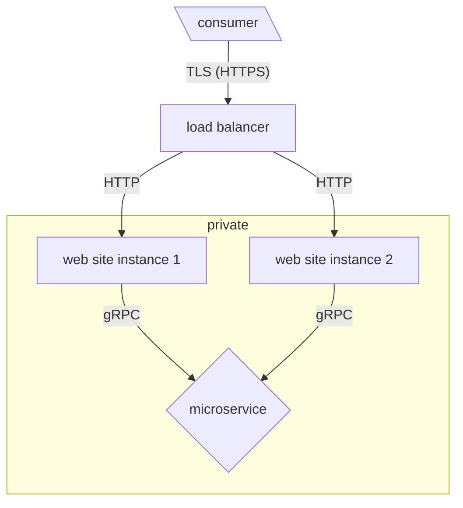

# go-arch

A sample go project that demonstrates a basic load balanced website over SSL with a private microservice on the backend.

```mermaid
flowchart TD
	c[\consumer\]
	lb[load balancer]
	subgraph private
		ws1[web site instance 1]
		ws2[web site instance 2]
		ms{microservice}
	end

	c -- TLS (HTTPS) --> lb
	lb -- HTTP --> ws1
	lb -- HTTP --> ws2
	ws1 -- gRPC --> ms
	ws2 -- gRPC --> ms
```
